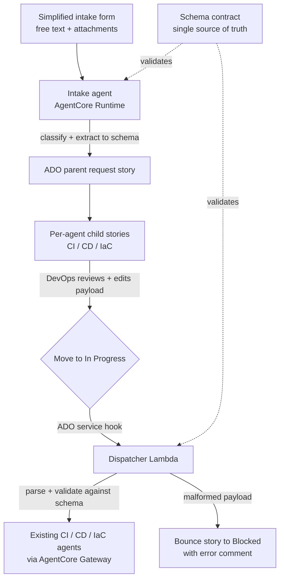

# Application Intake → Agent Orchestration: Implementation Guide

**Status:** Draft for team review
**Audience:** DevOps platform team, agent engineers
**Scope:** Self-service intake for application teams that routes to the existing CI, CD, and IaC agents

---

## 1. Purpose

Application teams do not understand the field-level intake forms used by the existing CI, CD, and IaC agents. We are giving them a **simplified intake** (free text describing their app, tech stack, services/endpoints, plus attachments such as architecture diagrams).

An **intake agent** translates that loose input into structured stories on our Azure DevOps (ADO) board. A **DevOps engineer reviews and edits** each story, then moves it to *In Progress*. That state change triggers a **downstream dispatcher** which calls the existing agents with the exact payload they already expect.

The design goal that everything below serves: **a generated story must carry the same payload the original intake form would have produced** — and the human edit and the automation must never disagree.

---

## 2. End-to-end flow



---

## 3. Non-negotiable design principles

These are the decisions that keep the system correct. Treat them as constraints, not preferences.

1. **The schema is the contract.** Each existing agent's intake form is reduced to a versioned schema. Both intake paths (the existing DevOps form and the new app-team path) converge on the same schema. It is validated at **two** points: when the intake agent produces a payload, and at dispatch before the existing agent is called.

2. **One source of truth, and the human edits it.** Because a DevOps engineer reviews and edits before *In Progress*, the thing they edit **must be the thing the dispatcher consumes**. No "pretty prose for humans, hidden JSON for machines." If the human edits something the dispatcher doesn't read, their corrections are silently lost.

3. **The payload is a recommendation the human can change.** The agent writes a complete, populated payload block — a starting point, not an abridged summary. What is shown is exactly and completely what gets sent. Every field the existing agent requires is present; nothing is filled from invisible defaults at dispatch time.

4. **The payload format is YAML.** `key: value`, one per line, readable and forgiving to hand-edit, but with a real spec, an off-the-shelf parser, and native support for lists/nesting when a payload stops being flat. Do not invent a custom `Field: value` format.

5. **Dispatch parsing is deterministic.** The dispatcher parses the YAML mechanically and validates against the schema. It does **not** re-read the story with an LLM. The one hop that must be boringly reliable stays boringly reliable.

6. **Provenance is visible.** Every recommended field is marked: came from the requester, inferred from an attachment, a playbook default, or missing. This tells the reviewer where to actually look. A clean, opaque payload gets rubber-stamped; a payload that shows its reasoning gets a real review.

7. **Structure is rendered by code, not the model.** The agent fills typed slots; a deterministic template renderer lays out the story. Consistency is guaranteed by the renderer, not by the model remembering a template.

---

## 4. Components

| Component | Responsibility | Implementation |
|---|---|---|
| Simplified intake form | Capture free text + attachments from app teams | Existing front end / form, posts to the intake agent |
| Intake agent | Classify (CI/CD/IaC), extract fields, read diagrams, write stories | AgentCore Runtime; docs + playbook in system prompt; multimodal model |
| Schema contract | Define required payload per agent; the single source of truth | Versioned JSON Schema files, stored in repo with templates |
| Template renderer | Render parent + child stories from a structured object | Deterministic code (in the intake agent or a helper Lambda) |
| ADO board | Hold parent request + per-agent child stories | Azure DevOps Boards, via ADO MCP server + REST for attachments |
| Human review gate | DevOps reviews prose, edits payload, moves to In Progress | Manual; backed by a pre-flight validation gate |
| Dispatcher | On In Progress: parse, validate, invoke the right existing agent | Lambda triggered by ADO service hook |
| Existing CI/CD/IaC agents | Unchanged downstream automation | Exposed to the dispatcher as tools via AgentCore Gateway |

---

## 5. Data contracts

### 5.1 Per-agent schema (example: CD)

One versioned JSON Schema per agent, derived from the existing intake form's fields and validation rules.

```json
{
  "$id": "cd-payload",
  "version": "1.0.0",
  "type": "object",
  "required": ["app_name", "container", "environment", "replicas", "health_check_path"],
  "additionalProperties": false,
  "properties": {
    "app_name":          { "type": "string" },
    "container":         { "type": "string", "enum": ["ECS", "EKS", "Fargate"] },
    "environment":       { "type": "string", "enum": ["dev", "staging", "prod"] },
    "replicas":          { "type": "integer", "minimum": 1 },
    "health_check_path": { "type": "string", "pattern": "^/" },
    "endpoints":         { "type": "array", "items": { "type": "string" } }
  }
}
```

The same schema validates: the existing DevOps form, the intake agent's output, and the dispatcher's pre-call check.

### 5.2 Story templates

Two templates, both rendered by code. The **skeleton is identical across all three agents** (same sections, same order). The only part that differs per agent is the payload field set, which is **generated from that agent's schema** — so it can never drift from the contract.

**Child story template (CI / CD / IaC):**

```
# [CD] {{app_name}} — {{intent_summary}}

## Context
{{summary_prose}}

## Source
- Parent request: {{parent_link}}
- Submitted by: {{requester}}
- Attachments: see parent request

## Recommended deployment payload
> Edit these values, then move the story to In Progress.

​```yaml
{{payload_yaml}}   # every required field from the CD schema, present
​```

## Assumptions & provenance
{{provenance_list}}

## Before you move to In Progress
{{reviewer_checklist}}

---
template: cd-story v{{template_version}} · schema: cd-payload v{{schema_version}} · confidence: {{confidence}}
```

**Parent (request) story template** is separate: request narrative, the classification decision and *why* those agents were chosen, links to the child stories spawned, and a status rollup.

### 5.3 Rendered payload with provenance

The payload block as the DevOps engineer sees it. Provenance lives in inline comments the parser ignores.

```yaml
app_name: payments-api        # from requester
container: ECS                # inferred from architecture diagram
environment: staging          # from requester
replicas: 2                   # playbook default — confirm
health_check_path: /healthz   # MISSING — required, please fill
endpoints:                    # inferred from diagram
  - https://payments-api/internal
  - https://payments-api/health
```

---

## 6. Step-by-step implementation

### Phase 0 — Foundations (do first)

1. **Extract schemas.** For each of CI, CD, IaC, capture the existing intake form's fields, types, enums, and validation rules into a versioned JSON Schema (section 5.1). This is the highest-leverage task; everything depends on it.
2. **Define the tag vocabulary.** Decide the specialized routing/classification tags (e.g. `agent:ci`, `agent:cd`, `agent:iac`, `intake:app-self-service`).
3. **Pre-create tag definitions in ADO.** Create each tag once in the project so the agent only ever *applies existing* tags. This sidesteps the "Create tag definition" permission, which otherwise blocks an agent identity from minting new tags.
4. **Stand up the repo.** Schemas + templates live together so a schema change and its template impact are reviewed in the same diff.

### Phase 1 — Template renderer

5. Build a deterministic renderer that takes a structured object and emits the parent and child story bodies (section 5.2). The payload-field section is generated by walking the schema; the skeleton is fixed.
6. Stamp `template version` and `schema version` into every rendered story footer.

### Phase 2 — Intake agent (AgentCore Runtime)

7. Wire the **documentation and playbook into the system prompt.** The playbook governs *how* to write — good summaries, sensible recommendations, what "good" looks like. It does **not** own structure or guarantee field completeness.
8. Have the agent emit a **structured object**, not free prose: the classification (which of CI/CD/IaC apply, with rationale), each payload field's value **and** provenance, and the prose for the free-text sections.
9. Use the **multimodal model to read attached diagrams** and pull services/endpoints/tech-stack values, marking them `inferred from diagram`.
10. **Validate the agent's output against the schema** before any story is created. Required-but-missing fields are emitted as `MISSING` rather than fabricated.

### Phase 3 — Story creation on ADO

11. Create the **parent request story** with `wit_create_work_item`.
12. Create the **child stories in one batch** under the parent with `wit_add_child_work_items` (CI/CD/IaC, only those that apply).
13. Set the **specialized tags** via the `System.Tags` field on create/update (semicolon-separated). Tags are a field, not a separate object.
14. **Attach the team's files to the parent** (see section 7.2 — this uses the ADO REST API, not the MCP). Children reference the parent's attachments rather than duplicating them.

### Phase 4 — Human review gate

15. The DevOps engineer reads the prose for context, **edits the YAML payload** to correct anything (provenance comments tell them where to look), and moves the child story to **In Progress**.
16. A **pre-flight validation gate** runs on the transition: if the payload doesn't parse or doesn't conform to the schema, the transition is rejected (or immediately bounced — see Phase 5).

### Phase 5 — Dispatcher

17. Configure an **ADO service hook** on the work-item state change to *In Progress*, targeting the dispatcher Lambda. Each child story transitions independently.
18. The dispatcher:
    - reads the payload block,
    - **parses the YAML deterministically** (first-colon split, type coercion, no LLM),
    - **validates against the schema** (required present, enums/ranges satisfied, no unknown keys silently swallowed),
    - on success, **invokes the matching existing agent via AgentCore Gateway** with the exact payload,
    - on failure, **bounces the story to Blocked** with the specific validation error as a comment.
19. **Idempotency:** write the invocation id + result back onto the story; skip if already dispatched (service hooks can fire more than once).
20. Set a **terminal state** per child (Done / Failed-with-error). The parent shows a rollup; partial success is expected (IaC can succeed while CD fails).

### Phase 6 — Hardening

21. **Observability:** trace intake → classification → story → dispatch → agent call (AgentCore Observability + ADO history).
22. **Versioning:** each story records the schema + template version it was written against; the dispatcher selects the matching agent contract.
23. **Replay/diagnostics:** keep the structured intake object so a story can be regenerated if a template or schema changes.

---

## 7. Azure DevOps specifics

### 7.1 What the ADO MCP server does for us

- `wit_create_work_item` — create the parent and individual work items with field-level control.
- `wit_add_child_work_items` — batch-create the CI/CD/IaC children under the parent.
- `wit_update_work_item` — JSON Patch updates (fields, tags, state) where needed.
- Tags: set via the `System.Tags` field on create/update.

### 7.2 Attachments — the one gap to plan around

**The official ADO MCP server cannot upload attachments to work items.** Its work-item tools create text fields and can *download* an existing attachment, but there is no tool to upload/attach a file on create or update.

**Workaround — ADO REST API, two steps:**
1. `POST` the file to the attachments endpoint → returns a reference URL.
2. `PATCH` the work item to add an `AttachedFile` relation pointing at that URL.

Implement this as a small Lambda exposed to the intake agent as a tool via AgentCore Gateway (or call REST directly from the agent). Use the MCP for create/fields/tags, REST for the attachment step.

**Limits:** up to 100 attachments per work item, 60 MB each. Attaching to the parent only (children reference it) keeps you well under the ceiling.

> **Verify before building:** the missing upload tool is an open item on a fast-moving repo. Check the current ADO MCP toolset before committing to the REST workaround — a native attachment tool would simplify this if it has shipped.

### 7.3 Tag permission note

By default, Contributors/Stakeholders can apply existing tags, but creating **new** tag definitions is gated by the project-level *Create tag definition* permission. Pre-creating the tag vocabulary (Phase 0, step 3) means the agent only applies existing tags and never needs that permission.

---

## 8. Dispatcher logic (reference)

```text
on ADO service hook (state -> In Progress) for child story S:
    if S already has invocation_id:        # idempotency
        return  (already dispatched)

    payload = parse_yaml(S.payload_block)  # deterministic, no LLM
    agent   = agent_for(S.tags)            # ci | cd | iac

    errors = validate(payload, schema_for(agent, S.schema_version))
    if errors:
        set_state(S, "Blocked")
        add_comment(S, format(errors))     # specific, actionable
        return

    result = gateway.invoke(agent, payload)
    write_back(S, invocation_id=result.id, result=result)
    set_state(S, result.ok ? "Done" : "Failed")
```

---

## 9. Guardrails & failure modes

| Risk | Guardrail |
|---|---|
| Agent fabricates a required infra value | Emit `MISSING` + provenance markers; human reviews before In Progress |
| Human edits prose but not the payload | Single source of truth: the human edits the payload that fires |
| Hidden defaults applied at dispatch | Payload shown is exactly and completely what is sent |
| Hand-edit breaks the YAML | Deterministic parse + schema validation at dispatch; bounce to Blocked |
| Story moved to In Progress while malformed | Dispatcher validates and refuses to call the agent on bad input |
| Service hook fires twice | Idempotency key on the story |
| Schema changes break old stories | Version stamped per story; dispatcher matches the recorded version |
| Invalid enum typed freehand (`ecs` vs `ECS`) | Schema enum rejects it; prefer native ADO fields with dropdowns if available |

---

## 10. Prerequisites & open decisions for the team

1. **Field inventory** for all three existing intake forms (drives the schemas). *Owner: ___*
2. **Native fields vs YAML block in ADO:** can the board carry per-agent custom fields (with dropdowns for enums) instead of a freehand YAML block? Native fields make invalid values unpickable rather than caught after the fact. *Decision needed.*
3. **Intake mode:** one-shot form submission, or can the intake agent ask clarifying questions before creating stories? Affects how gaps are handled. *Decision needed.*
4. **Tag vocabulary** finalized and pre-created in ADO. *Owner: ___*
5. **Agent identity & permissions** in ADO (apply-tags only; service hook config; REST access for attachments). *Owner: ___*
6. **Gateway wiring** of the three existing agents as callable tools. *Owner: ___*

---

## 11. Glossary

- **Intake agent / orchestrator** — the new agent that classifies and writes stories.
- **Dispatcher** — the Lambda that fires on *In Progress* and calls the existing agents.
- **Schema contract** — versioned JSON Schema per agent; the single source of truth for payload shape.
- **Provenance** — per-field origin marker (requester / inferred / default / missing).
- **Payload block** — the human-editable YAML in the child story that the dispatcher consumes verbatim.
